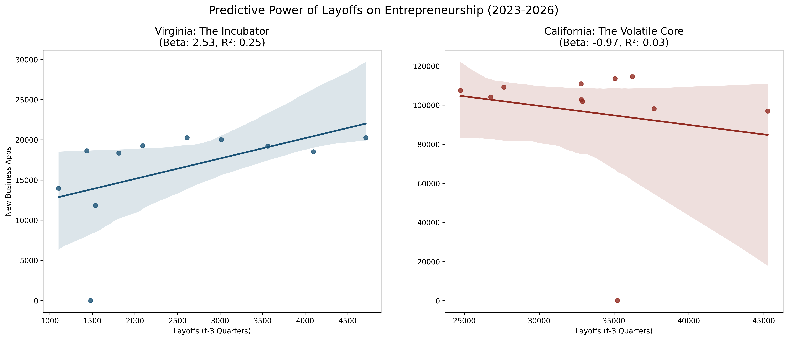

# warn_entrepreneurship

# The Entrepreneurial Lag: Predicting Business Formation via Labor Market Shocks

# Summary
Does a layoff today predict a new business tomorrow? This project analyzes the relationship between WARN Act mass layoff notices and High-Propensity Business Applications (Census BFS) across U.S. states from 2023–2026. Using OLS regression on quarterly aggregated data, I find a statistically significant 9-month lag between layoffs and business formation at the national level — but with substantial geographic heterogeneity that complicates any simple "necessity entrepreneurship" narrative.

# Key Findings
National estimate: A 1,000-unit increase in quarterly layoffs is associated with approximately 2,313 additional high-propensity business applications nine months later (β = 2.31, p < 0.001, 95% CI: 1.98-2.64). This association is descriptive — WARN notices are plausibly correlated with unobserved local economic conditions that independently drive formation, and a valid causal estimate would require an instrument or discontinuity design exploiting variation in state WARN thresholds. The more actionable finding is the geographic divergence. 

## Geographic Divergence: 
1.  The Incubator (VA): High predictability ($R^2=0.25$). Layoffs are a mechanical leading indicator of growth.
2.  The Opportunity Hub (GA/NC): Low predictability ($R^2=0.07$). Entrepreneurship is driven by "Opportunity" rather than "Necessity," making traditional layoff data a poor predictor.  The state policies surrounding layoffs also mirror the federal standard, meaning that there are fewer WARN notices unless the scale of the layoffs is large.  More data is needed to understand drivers of entrepreneurship in these markets.
3.  The Volatile Core (CA/WA): Pro-cyclical. Layoffs act as a systemic shock that suppresses business formation rather than catalyzing it.

| State Type | Representative | Multiplier ($\beta$) | $R^2$ | Interpretation |
| :--- | :--- | :--- | :--- | :--- |
| **Incubator** | Virginia (VA) | 2.53 | 0.25 | Predictable talent recycling pipeline. |
| **Opportunity Hub** | Southeast (GA/NC)| 0.96 | 0.07 | Decoupled; growth is organic/non-necessity. |
| **Volatile Core** | California (CA) | -0.97 | 0.03 | Pro-cyclical; shocks suppress formation. |

  
  
   
  <em>Figure 1: Comparison of 9-month lagged trends. Note the tight coupling in Virginia's "Incubator" economy versus the divergence in California.</em>

# Data Sources
WARN Act Data: Cleaned and standardized regulatory filings (Mass Layoff Notices).

Census Bureau BFS: Business Formation Statistics, filtered for "High-Propensity" applications (those likely to hire employees).

# Analysis Notes
* Initially, a high correlation was observed ($r=0.36$) in DC, but further "Growth-to-Growth" testing (using percent changes) revealed this was an artifact of the COVID-19 recovery period. To find the true signal, I moved to Quarterly Aggregation To "denoise" the temporal jitter of government reporting cycles and restricted sample to the post-COVID period (2023-2026).  

* OLS Regression was used to analyze the relationship between layoffs and new business formation and observe the strength of the relationship ($R^2$).

* Negative Control: Conducted a first-difference (percent change) correlation check. In DC, growth-to-growth correlation collapsed from 0.36 to 0.063 when detrended, identifying the "COVID-period trend" as a confounding variable and necessitating the pivot to quarterly OLS modeling.  The change in correlation is depicted in the table below.

| Metric | Level Analysis | Growth-to-Growth | Aggregated OLS |
| :--- | :--- | :--- | :--- |
| **Raw Correlation** | 0.36 | 0.063 | 0.60 |
| **Findings** | High (Confounded) | Low (Noisy) | **High** |
| **The "Why"** | Driven by COVID trends. | Monthly jitter hides signal. | Quarterly windows reveal the 9-month lag. |

* Handling Zero-Inflation & Reporting Gaps.  In "Federal Standard" states (GA, NC) where reporting thresholds are high (500+ employees), I employed Regional Pooling to capture latent signals that are otherwise lost in state-level noise. 

# Labor Market Implications
1.  Necessity vs. opportunity entrepreneurship vary by region. The low predictive power of layoffs in GA/NC suggests formation in these markets is primarily opportunity-driven and decoupled from labor market shocks — consistent with the broader literature on entrepreneurship motivation heterogeneity.
2.  State WARN thresholds create measurement gaps. Federal-standard states (500+ employee threshold) systematically underreport layoff activity, which suppresses the observable signal and likely understates the true relationship in high-threshold states. This is a data quality issue as much as an economic one.
3.  Pro-cyclical suppression in high-cost tech hubs. The negative coefficient in CA/WA suggests layoffs in these markets function as systemic shocks rather than talent reallocation events — possibly due to housing costs, industry concentration, or capital market conditions depressing new venture formation even as labor supply increases.

# Limitations & Next Steps

* Sample window (2023–2026) is short; findings may reflect post-COVID normalization rather than stable structural relationships.

* OLS specification does not control for regional economic conditions (GDP growth, housing costs, VC activity) that jointly determine both layoffs and formation.

* Causal identification would require exploiting cross-state variation in WARN reporting thresholds as an instrument — states with lower thresholds generate more layoff notices for a given level of actual displacement, creating plausibly exogenous variation.

* Monthly BFS data has reporting lags that introduce noise at high frequency; quarterly aggregation reduces but does not eliminate this.
  
# Tech Stack
Language: Python 3.13 
Libraries: pandas, statsmodels (OLS), numpy, matplotlib
Methodologies: Time-Series Lag Analysis, Detrending (First-Differencing), Regional Pooling.
